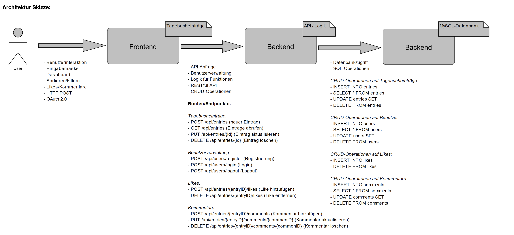

*Onlinediary (Online-Tagebuch)*

*1. Frontend-Entwicklung*

- Benutzeroberfläche: Das Design und die Entwicklung einer intuitiven
und benutzerfreundlichen Oberfläche, die es Benutzern ermöglicht,
Einträge einfach zu erstellen, zu bearbeiten und zu durchsuchen. +
- Responsive Design: Sicherstellen, dass die Anwendung auf verschiedenen
Geräten (Desktop, Tablets, Smartphones) gut funktioniert. +
- Benutzerinteraktion: Implementierung einer effektiven Suche und
möglicherweise Filterfunktionen, um ältere Tagebucheinträge leicht zu
finden. +
- Likes und Kommentare: Hinzufügen der Möglichkeit, Tagebucheinträge zu
liken und Kommentare zu hinterlassen. Diese Funktionen sind als Threads
zu den Tagebucheinträgen integriert und ermöglichen es den Benutzern,
direkt mit den Einträgen zu interagieren.

 

* 2. Backend-Struktur*

- CRUD-Operationen: Entwicklung einer API, die das Erstellen, Lesen,
Aktualisieren und Löschen von Tagebucheinträgen sowie das Hinzufügen und
Abrufen von Likes und Kommentaren unterstützt. +
- Benutzerverwaltung: Implementierung von Funktionen für
Benutzerregistrierung, Login und Session-Management, wobei Datenschutz
und Sicherheit wichtig sind. +
- Likes und Kommentare: Entwicklung spezifischer API-Endpunkte für das
Verwalten von Likes und Kommentaren, einschließlich Endpunkten für das
Hinzufügen und Löschen von Likes sowie das Hinzufügen, Bearbeiten und
Löschen von Kommentaren.

 

* 3. Datenhaltung*

- Datenbankdesign: Entwurf einer Datenbankstruktur, die die
Tagebucheinträge, Benutzerinformationen, Likes, Kommentare und
möglicherweise auch Stimmungsdaten effizient speichert. +
- Datensicherheit: Gewährleistung der Sicherheit der Daten durch
Verschlüsselung, sowohl bei der Speicherung als auch bei der Übertragung
(OAuth 2.0) .

 

*4. Sicherheit und Datenschutz*

- Datenschutz: Da es sich um sehr persönliche Daten handelt, ist der
Schutz der Privatsphäre von großer Bedeutung.

- Verschlüsselung: Implementierung von Sicherheitsmaßnahmen, wie die
Verschlüsselung der Tagebucheinträge, um sicherzustellen, dass die
Inhalte auch bei einem Datenleck geschützt sind.

 

*5. Zusatzfunktionen (Bonus)*

- Stimmungstracking: Entwicklung einer Funktionalität, die es
ermöglicht, die Stimmung der Einträge zu erfassen und zu analysieren,
was zusätzliche Überlegungen zum Datenschutz erfordert.

- Analyse und Visualisierung: Erstellung von Statistiken und Graphen,
die den Benutzern helfen, Muster in ihren Stimmungen oder
Tagebucheinträgen zu erkennen.

 

*Technologien:* Typescript, React, NodeJS, MySQL, OAuth 2.0 

.Architektur Skizze

