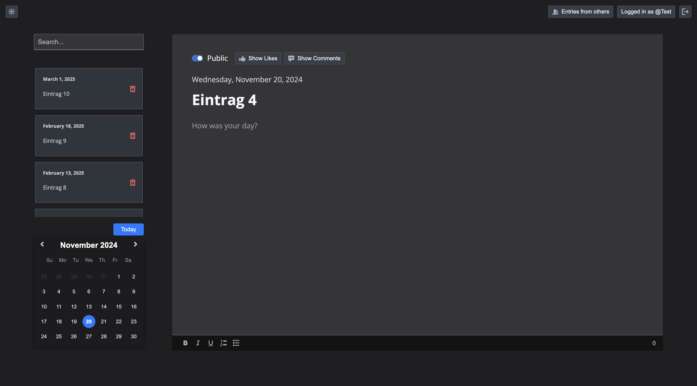

# Onlinediary

## Projektübersicht

Onlinediary ist eine moderne, voll funktionsfähige Webanwendung zum Führen von Tagebüchern, die eine Microservices-Architektur (DDD) mit Node.js, Express, PostgreSQL, React und Docker nutzt. Die Anwendung bietet eine umfassende Plattform für das Erstellen und Verwalten von Journaleinträgen und integriert Features wie Benutzer-Authentifizierung, Kommentare, Likes und einen Light-/Darkmodus.

Die Microservices-Struktur ermöglicht eine robuste und skalierbare Architektur, die es den einzelnen Diensten wie Benutzerverwaltung, Kommentare, Likes und Authentifizierung erlaubt, unabhängig voneinander zu arbeiten und bei Bedarf angepasst oder erweitert zu werden. Diese Architektur macht Onlinediary zu einer flexiblen Lösung für zukünftige Erweiterungen und Anpassungen.

## Funktionen

- **Journalführung**: Benutzer können Journaleinträge mit vielfältigen Formatierungsoptionen wie Fett-, Kursivschrift und Listen erstellen. Einträge können mit nur einem Klick öffentlich gemacht werden, damit andere Benutzer sie sehen und darauf reagieren können.
- **OAuth-Login**: Sicherer Zugriff durch bevorzugte Anmeldung via GitLab, wobei GitLab OAuth2 für erhöhte Sicherheit genutzt wird.
- **Kommentare und Likes**: Nutzer können auf öffentliche Einträge kommentieren und diese liken, was Interaktion und Austausch zwischen den Nutzern fördert.
- **Suchfunktion**: Schnelles Auffinden früherer Einträge mithilfe der Suchleiste.
- **Moduswechsel**: Wechsel zwischen Dunkel- und Hellmodus, um die Benutzeroberfläche an persönliche Vorlieben anzupassen.
- **Vollständige Responsivität**: Optimierte Benutzererfahrung auf Desktop, Tablet und Mobilgeräten.
- **API-Dokumentation**: Zugriff auf die vollständige API-Dokumentation über SwaggerUI für Entwickler, die die verfügbaren Endpunkte testen und implementieren möchten.

## Zielgruppe

Onlinediary richtet sich an Nutzer, die eine sichere und vielseitige Lösung zum Führen eines digitalen Tagebuchs suchen. Besonders geeignet für Studierende, Kreative und alle, die ihre Gedanken digital festhalten und teilen möchten.

## Nutzung und Technologie

- **Frontend**: React und Redux bieten eine dynamische, benutzerfreundliche Oberfläche.
- **Backend**: Node.js und Express verwalten die Dienste, die in Docker-Containern laufen und eine reibungslose Integration mit der zentralen PostgreSQL-Datenbank gewährleisten.
- **Tests**: Umfassende Jest-Tests sichern die Qualität der Anwendung und gewährleisten die Stabilität aller Microservices.

Onlinediary vereint moderne Webtechnologien, Sicherheit und Benutzerfreundlichkeit in einer flexiblen Plattform für das digitale Journaling. 

**Besuchen Sie Onlinediary und dokumentieren Sie ihre täglichen Erlebnisse!**
