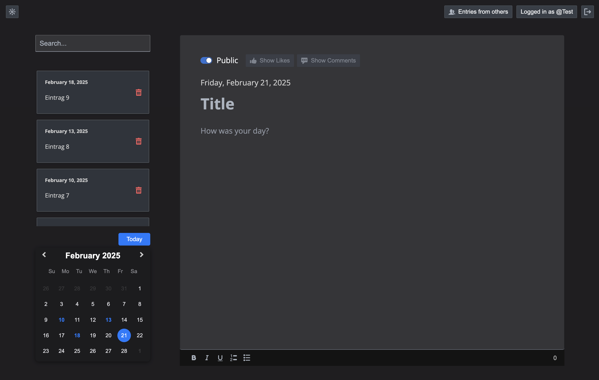
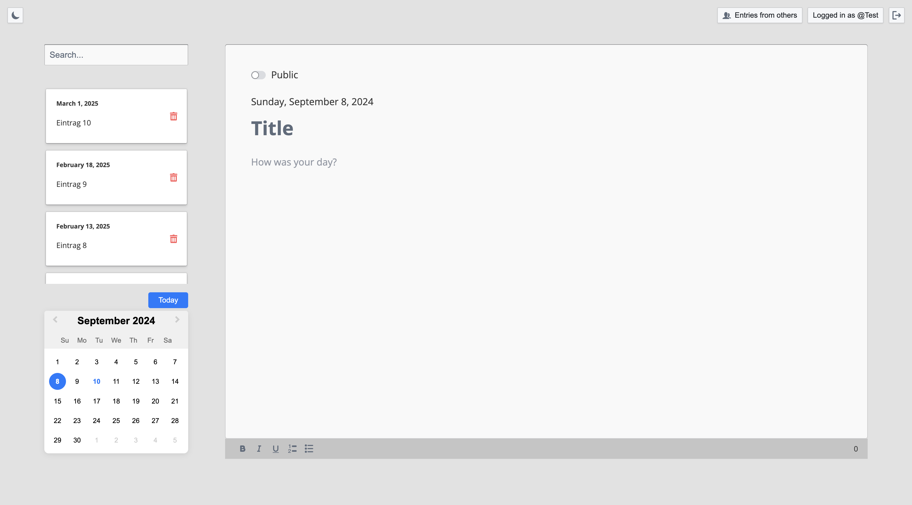

# Onlinediary

A full-stack journaling web application utilizing microservices architecture with Node.js, Express, PostgreSQL, React, and Docker. The application provides a comprehensive journaling platform integrated with user authentication, comments, likes, and mode switching features.

## Table of Contents

* link:#overview[Overview]
* link:#getting-started[_Getting Started_]
* link:#environment-setup[*Environment Setup*]
* link:#starting-the-application[Starting the Application]
* link:#using-the-application[Using the Application]
* link:#accessing-api-documentation[Accessing API Documentation]
* link:#running-tests[Running Tests]
* link:#dependencies[Dependencies]
* link:#galery[Galery]


## Overview

Onlinediary is a microservices-based web application for journaling, featuring multiple backend services (auth, users, journals, comments, likes, mode, and gateway) running within Docker containers and interacting with a central PostgreSQL database. The frontend is built using React and Redux, providing a dynamic and responsive user interface.

## Getting Started

1. **Clone or Download the Repository**: Clone this repository onto your local device.

2. **Install Docker and Docker Compose**: Ensure that Docker and Docker Compose are installed on your system. You can verify the installation with:

   ```
   docker --version
   docker-compose --version
   ```

   If not installed, refer to the [Docker](https://docs.docker.com/get-docker/) and [Docker Compose](https://docs.docker.com/compose/install/) documentation for installation instructions.

3. **Environment Files**: Ensure that the required `.env` files are present in the root and service directories. These files must contain the correct configuration for database access, secret keys, and service ports.

4. **Initialize the Database**: The PostgreSQL database is automatically initialized using the `backup.sql` script provided in the `db` service configuration. The database schema and data will be set up when the Docker container starts. The database is already filled with some data for testing purposes.

## Environment Setup

### Main .env File

Ensure that the main `.env` file in the root directory contains the contains the required values.

Each microservice may also have its specific `.env` file with relevant environment variables tailored for that service.


*Note: To make testing as easy as possible, the .env was left in the repo. After testing and evaluation have been completed, it can be removed.*

## Starting the Application

1. **Run the start-all.sh Script**: Use the `start-all.sh` script to build and start the application. This script will handle the creation and startup of all Docker containers. *(The shell script is here: onlinediary/Source/OnlineDiary/start-all.sh)*

   ```
   ./start-all.sh
   ```

*Note: Make sure you have Docker running and are logged in to docker. If permission denied appears, try* ```sudo ./start-all.sh"```

2. **Access the Application**:

   - **Frontend**: [http://localhost:3000](http://localhost:3000)
   - **API Gateway**: [http://localhost:4000/api-docs](http://localhost:4000/api-docs)

   The script will display the status of all running containers upon successful startup.

3. **Stopping the Application**:

   To stop and remove all running containers, you can use the following command:

   ```
   docker-compose down
   ```


## Using the Application

Once the application is running, you can access it via the frontend at [http://localhost:3000](http://localhost:3000).

### Key Features:

- **Authentication**: You can log in securely using OAuth with GitLab, which is the preferred method for accessing the application. *(Logging in without GitLab is for emergency or testing purposes only. GitLab is more secure due to OAuth2.)*

- **Journaling**: Start writing your journal entries with various formatting options, such as bold, italic, and lists. Your changes are saved automatically after a few seconds of inactivity. You can see whether your entry has been saved when ...saving has changed to saved in the middle at the bottom of the editor. You can make your entry public via a switch so that other users can see it, like it and comment on it. It will not be visible to others who made the entry. The "Entries from others" button takes you to a dashboard where you can see all public entries.

- **Search**: Use the search bar to find past entries quickly and efficiently.
- **Comments and Likes**: Interact with journal entries by commenting and liking posts. Users can edit and delete their own comments directly within the comment section by clicking the link belew their comment. A prompt appears, allowing the user to modify the comment text. 
- **Mode Switching**: Toggle between light and dark modes based on your preference.
- **Error Handling**: If something goes wrong, you’ll see a friendly error message guiding you back to the main flow.
- **Account Management**: Easily manage your profile settings and log out with a simple click.
- **Responsive Design**: The application is fully responsive and optimized for all devices, including desktops, tablets, and mobile phones, providing a seamless experience no matter where you are.
- **API Documentation**: Access to the full API documentation via SwaggerUI for developers who want to test and implement the available endpoints.


### Tips for Use:

- **Test Accounts**: For testing purposes, 2 accounts were created which can be accessed using the following login details:
```
USERNAME: Test
PASSWORD: hallo
```
```
USERNAME: Testo
PASSWORD: 1
```
- **Editing Entries**: Click on any date in the calendar to view or edit entries for that day.
- **Security**: For your security, the application will lock itself after a period of inactivity. Simply log back in to continue where you left off.

Enjoy journaling with Onlinediary!


## Accessing API Documentation

For developers, the full API documentation can be accessed via SwaggerUI at [http://localhost:4000/api-docs](http://localhost:4000/api-docs). This interface provides a detailed overview of available endpoints, their parameters, and allows for testing directly in the browser.

*Note: Most API requests require the user to be logged into the application, so make sure you are logged into another tab in the online diary with an active session if you want to test all Swagger UI features.*

## Running Tests

To ensure the application runs smoothly and meets all quality standards, you can execute tests for both the frontend and backend services. Here's how you can run all the tests:

### Running All Tests

You can run all tests from the project root directory (Source/OnlineDiary) using the following command:

```bash
npm test
```

This command will trigger all frontend and backend tests sequentially.

In this case, a combined-test-report.html is created at the end, which can be called up in the browser (copy the link from the console into the browser and call it up). All test results can then be viewed clearly in the browser.

### Running Tests seperatly

**Running Backend Tests**
To run all backend tests use:

```bash
npm run test:frontend
```

This will execute tests for all backend services, ensuring each service operates correctly within its expected parameters.

**Running Backend Tests**
Backend tests are separated by each microservice. To run all backend tests together, use:

```bash
npm run test:backend
```

This will execute tests for all backend services, ensuring each service operates correctly within its expected parameters.

**Running Tests for Individual Services**

You can also run tests for each backend service individually. Here are the commands for each:

Service-tests:

```bash
npm run test:SERVICE_NAME
```

Set SERVICE_NAME to one of the following: auth, comments, gateway, journals, likes, mode, users


## Dependencies

### Client

* link:https://reactjs.org/[React]
* link:https://redux.js.org/[Redux]
* link:https://mui.com/[Material-UI]
* link:https://axios-http.com/[Axios]
* link:https://momentjs.com/[Moment.js]
* link:https://draftjs.org/[Draft.js]

### Server

* link:https://nodejs.org/[Node.js]
* link:https://expressjs.com/[Express]
* link:https://www.postgresql.org/[PostgreSQL]
* link:https://github.com/dcodeIO/bcrypt.js[bcrypt.js]
* link:https://github.com/auth0/node-jsonwebtoken[jsonwebtoken]
* link:https://github.com/motdotla/dotenv[dotenv]
* link:https://jestjs.io/[Jest]

## Galery

.Dark-Editor


{empty} +

.Light-Editor


{empty} +

.Dark-Dashboard
image::Documentation/Pictures/3_Dashboard.png[Dark-Dashboard, width=600, height=400, align=center]

{empty} +

.Light-Dashboard
image::Documentation/Pictures/3_W_Dashboard.png[Light-Dashboard, width=600, height=400, align=center]

{empty} +

.Journal-Card
image::Documentation/Pictures/4_Modal.png[Journal-Card, width=600, height=400, align=center]

{empty} +

.Login
image::Documentation/Pictures/5_Login.png[Login, width=600, height=400, align=center]

{empty} +

.ablet-View
image::Documentation/Pictures/6_Tablet.png[Tablet-View, width=600, height=400, align=center]

{empty} +

.Smartphone-View
image::Documentation/Pictures/7_Smartphone.png[Smartphone-View, width=600, height=400, align=center]
